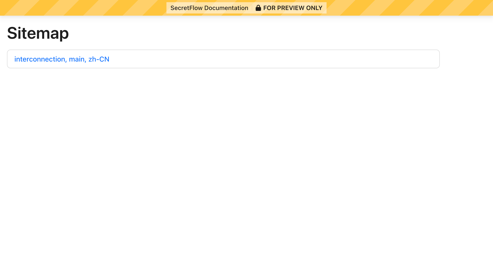
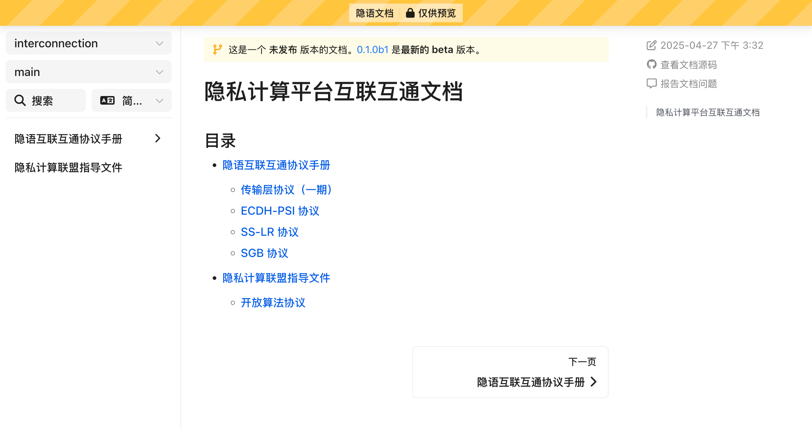

# 文档贡献指南 | Contributing docs <!-- omit from toc -->

- [tl;dr](#tldr)
- [前置条件](#前置条件)
- [环境准备](#环境准备)
- [构建文档](#构建文档)
- [预览文档](#预览文档)
- [文件清理](#文件清理)
- [报告问题](#报告问题)

## tl;dr

```sh
python -m pip install -r requirements.txt
secretflow-doctools build --lang zh_CN
secretflow-doctools preview
```

> [!TIP]
>
> 下文的示例命令建议在[本目录 (docs)](./) 下执行。

## 前置条件

本项目使用 [Sphinx] 作为文档框架。你需要：

- [Python] >= 3.10

## 环境准备

执行：

```sh
python -m pip install -r requirements.txt
```

这将会：

- 安装[文档构建所需要的依赖](./requirements.txt)

> [!TIP]
>
> 你也可以使用 [uv], [mamba] 等其他的依赖管理工具。

## 构建文档

[`secretflow-doctools`] 是针对隐语项目文档构建的辅助工具，它协助开发者在本地构建并
且[预览](#预览文档)文档。

执行：

```sh
secretflow-doctools build --lang en --lang zh_CN
```

这将会构建英文版 `en` 以及中文版 `zh_CN` 文档。

如果一切正常，你应当能看到以下输出：

```log
SUCCESS  to preview, run: secretflow-doctools preview -c .
```

> [!TIP]
>
> 如果提示 `secretflow-doctools` 命令未找到，你可能没有执行 `source .venv/bin/activate`
> 以激活正确的 Python 环境；请参考[环境准备](#环境准备)中的指引。

如果想要只构建某个语言的文档，可以调整 `--lang` 选项。

## 预览文档

工具提供了本地预览的能力，帮助开发者验证文档在**发布到[隐语官网][website]后的显示效
果**。

执行：

```sh
secretflow-doctools preview
```

这将会在本地启动一个预览服务器。你应当能看到以下输出：

```
 * Running on http://127.0.0.1:5000
```

用浏览器访问 <http://127.0.0.1:5000> （或其它端口号），你应当能看到类似下图的页面，其中
将会列出在本地构建好的文档版本：

<figure>
  
</figure>

点击一个版本即可打开对应预览，你应当能看到类似下图的页面：

<figure>
  
</figure>

> [!TIP]
>
> 你可以保持预览服务器一直开启：在重新构建文档后，刷新页面即可看到更新的内容。

## 文件清理

以上流程会产生额外的临时文件，这些文件全部位于 [\_build](./_build/) 目录下。如果需要清理
，可以执行：

```sh
secretflow-doctools clean
```

## 报告问题

如果在以上过程中遇到报错、预览无法显示等问题，可以提交问题到
<https://github.com/secretflow/doctools/issues>。

文档内容及本项目代码的相关问题请提交到本项目的 Issues 中。

> [!NOTE]
>
> 为协助排查问题，你可以设置 `LOGURU_LEVEL=DEBUG` 环境变量来让文档工具输出更多日志。
>
> `secretflow-doctools` 会调用其他工具，在 `LOGURU_LEVEL=DEBUG` 时，日志会在每个步骤打印
> 完整的命令行指令：
>
> |                                           |                  |
> | :---------------------------------------- | :--------------- |
> | `secretflow-doctools build`               | [`sphinx-build`] |
> | `secretflow-doctools update-translations` | [`sphinx-intl`]  |

[`secretflow-doctools`]: https://github.com/secretflow/doctools
[`sphinx-apidoc`]: https://www.sphinx-doc.org/en/master/man/sphinx-apidoc.html
[`sphinx-build`]: https://www.sphinx-doc.org/en/master/man/sphinx-build.html
[`sphinx-intl`]: https://www.sphinx-doc.org/en/master/usage/advanced/intl.html
[gettext-po]: https://www.gnu.org/software/gettext/manual/html_node/PO-Files.html
[gettext]: https://www.gnu.org/software/gettext/
[mamba]: https://mamba.readthedocs.io/en/latest/
[Poedit]: https://poedit.net/
[Python]: https://www.python.org/
[Sphinx]: https://www.sphinx-doc.org/en/master/tutorial/index.html
[uv]: https://docs.astral.sh/uv/
[venv]: https://docs.python.org/3/library/venv.html
[website]: https://www.secretflow.org.cn/
