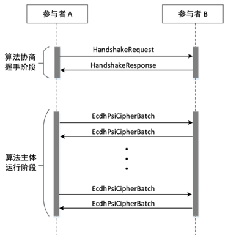
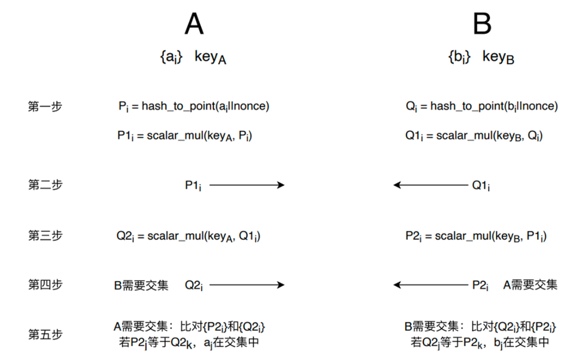

ECDH-PSI 协议
=========================

算法流程
------------------------

算法分为2阶段，第一阶段为握手过程，第二阶段为算法主体，其流程如下：

握手过程
^^^^^^^^^^^^^^^^^^^

握手所用的 HandshakeRequest 定义如下：

.. literalinclude:: ../../interconnection/legacy/algos/psi.proto
   :caption: interconnection/algos/psi.proto
   :language: Protobuf
   :start-after: [Sphinx doc begin anchor: HandshakeRequest]
   :end-before: [Sphinx doc end anchor: HandshakeRequest]
   :linenos:

HandshakeRequest 主要包括以下信息：

1. 协议版本号
2. 想使用的具体 PSI 算法，比如使用 ECDH-PSI
3. 每类 PSI 算法的详细参数，比如 ECDH-PSI 需要说明具体的椭圆曲线类型，HASH 算法相关参数等
4. 结果可见性说明：结果是A，B都可见，还是只对某一方可见

如果算法是 Ecdh-psi，则 HandshakeRequest 中的 algo_params 字段格式如下：

.. literalinclude:: ../../interconnection/legacy/algos/psi.proto
   :caption: interconnection/algos/psi.proto
   :language: Protobuf
   :start-after: [Sphinx doc begin anchor: EcdhPsiParamsProposal]
   :end-before: [Sphinx doc end anchor: EcdhPsiParamsProposal]
   :linenos:

握手请求的结果 HandshakeResponse 定义如下：

.. literalinclude:: ../../interconnection/legacy/algos/psi.proto
   :caption: interconnection/algos/psi.proto
   :language: Protobuf
   :start-after: [Sphinx doc begin anchor: HandshakeResponse]
   :end-before: [Sphinx doc end anchor: HandshakeResponse]
   :linenos:

其中 ResponseHeader 定义如下：

.. literalinclude:: ../../interconnection/common/header.proto
   :caption: interconnection/common/header.proto
   :language: Protobuf
   :start-after: [Sphinx doc begin anchor: ResponseHeader]
   :end-before: [Sphinx doc end anchor: ResponseHeader]
   :linenos:

algo_params 定义如下：

.. literalinclude:: ../../interconnection/legacy/algos/psi.proto
   :caption: interconnection/algos/psi.proto
   :language: Protobuf
   :start-after: [Sphinx doc begin anchor: EcdhPsiParamsResult]
   :end-before: [Sphinx doc end anchor: EcdhPsiParamsResult]
   :linenos:

Protobuf 传输方式
""""""""""""""""""""""""""""""

Protobuf 传输使用《传输层白盒互联互通协议》中的 P2P 传输协议进行传输。其中传输的 key 按照《传输层白盒互联互通协议》中定义的方法生成，value 即为 protobuf 序列化之后的二进制字符串。

算法主体
^^^^^^^^^^^^^^^^^^^

算法第二步、第四步使用 EcdhPsiCipherBatch 格式进行传输，EcdhPsiCipherBatch 定义如下：

.. literalinclude:: ../../interconnection/legacy/algos/psi.proto
   :caption: interconnection/algos/psi.proto
   :language: Protobuf
   :start-after: [Sphinx doc begin anchor: EcdhPsiCipherBatch]
   :end-before: [Sphinx doc end anchor: EcdhPsiCipherBatch]
   :linenos:

其中 ciphertext 字段用于存放 ECC 上的点，存放方式为所有点依次连续存放，curve25519 每个点长度为 32 Bytes，SM2/secp256k1 使用点压缩编码存放，每个点长度33byte，参见 `SEC1 <https://www.secg.org/sec1-v2.pdf>`_。
