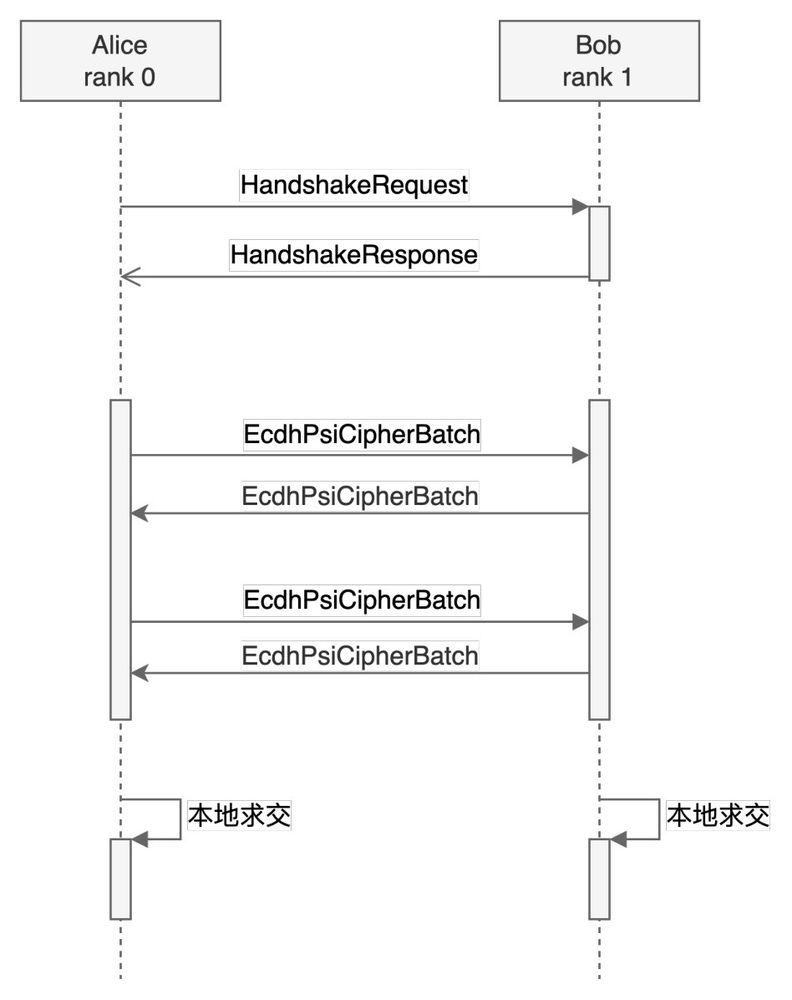

ECDH-PSI 协议
=========================

算法流程
------------------------

算法分为2阶段，第一阶段为握手过程，第二阶段为算法主体，其流程如下：

握手过程
^^^^^^^^^^^^^^^^^^^

握手所用的 HandshakeRequest 定义如下：

.. literalinclude:: ../../interconnection/handshake/entry.proto
   :caption: interconnection/handshake/entry.proto
   :language: Protobuf
   :start-after: [Sphinx doc begin anchor: HandshakeRequest]
   :end-before: [Sphinx doc end anchor: HandshakeRequest]
   :linenos:

HandshakeRequest 主要包括以下信息：

1. 协议版本号
2. 请求方的传输层 rank 值
3. 想使用的具体算法，比如使用 ECDH-PSI
4. 每类算法的详细参数，ECDH-PSI 算法忽略该字段
5. 用到的安全算子的类型，ECDH-PSI 算法忽略该字段
6. 每个安全算子的详细参数，ECDH-PSI 算法忽略该字段
7. 用到的密码协议族，比如 ECC 协议族
8. 每个协议族的详细参数，比如 ECC 协议族需要说明具体的椭圆曲线类型，哈希算法等参数
9. 算法的输入和结果输出格式，比如 ECDH-PSI 需要说明结果是A，B都可见，还是只对某一方可见

HandshakeRequest 中的 supported_algos 字段的定义如下：

.. literalinclude:: ../../interconnection/handshake/entry.proto
   :caption: interconnection/handshake/entry.proto
   :language: Protobuf
   :start-after: [Sphinx doc begin anchor: AlgoType]
   :end-before: [Sphinx doc end anchor: AlgoType]
   :linenos:

HandshakeRequest 中的 protocol_families 字段的定义如下：

.. literalinclude:: ../../interconnection/handshake/entry.proto
   :caption: interconnection/handshake/entry.proto
   :language: Protobuf
   :start-after: [Sphinx doc begin anchor: ProtocolFamily]
   :end-before: [Sphinx doc end anchor: ProtocolFamily]
   :linenos:

如果协议族是 ECC，则 HandshakeRequest 中的 protocol_family_params 字段格式如下：

.. literalinclude:: ../../interconnection/handshake/protocol_family/ecc.proto
   :caption: interconnection/handshake/protocol_family/ecc.proto
   :language: Protobuf
   :start-after: [Sphinx doc begin anchor: EccProtocolProposal]
   :end-before: [Sphinx doc end anchor: EccProtocolProposal]
   :linenos:

EccProtocolProposal 中的 ec_suits 字段的定义如下：

.. literalinclude:: ../../interconnection/handshake/protocol_family/ecc.proto
   :caption: interconnection/handshake/protocol_family/ecc.proto
   :language: Protobuf
   :start-after: [Sphinx doc begin anchor: EcSuit]
   :end-before: [Sphinx doc end anchor: EcSuit]
   :linenos:

如果算法是 ECDH-PSI，则 HandshakeRequest 中的 io_param 字段格式如下：

.. literalinclude:: ../../interconnection/handshake/algos/psi.proto
   :caption: interconnection/handshake/algos/psi.proto
   :language: Protobuf
   :start-after: [Sphinx doc begin anchor: PsiDataIoProposal]
   :end-before: [Sphinx doc end anchor: PsiDataIoProposal]
   :linenos:

握手请求的结果 HandshakeResponse 定义如下：

.. literalinclude:: ../../interconnection/handshake/entry.proto
   :caption: interconnection/handshake/entry.proto
   :language: Protobuf
   :start-after: [Sphinx doc begin anchor: HandshakeResponse]
   :end-before: [Sphinx doc end anchor: HandshakeResponse]
   :linenos:

其中 ResponseHeader 定义如下：

.. literalinclude:: ../../interconnection/common/header.proto
   :caption: interconnection/common/header.proto
   :language: Protobuf
   :start-after: [Sphinx doc begin anchor: ResponseHeader]
   :end-before: [Sphinx doc end anchor: ResponseHeader]
   :linenos:

如果协议族是 ECC，则 HandshakeResponse 中的 protocol_family_params 字段格式如下：

.. literalinclude:: ../../interconnection/handshake/protocol_family/ecc.proto
   :caption: interconnection/handshake/protocol_family/ecc.proto
   :language: Protobuf
   :start-after: [Sphinx doc begin anchor: EccProtocolResult]
   :end-before: [Sphinx doc end anchor: EccProtocolResult]
   :linenos:

如果算法是 ECDH-PSI，则 HandshakeResponse 中的 io_param 字段格式如下：

.. literalinclude:: ../../interconnection/handshake/algos/psi.proto
   :caption: interconnection/handshake/algos/psi.proto
   :language: Protobuf
   :start-after: [Sphinx doc begin anchor: PsiDataIoResult]
   :end-before: [Sphinx doc end anchor: PsiDataIoResult]
   :linenos:

Protobuf 传输方式
""""""""""""""""""""""""""""""

Protobuf 传输使用《传输层白盒互联互通协议》中的 P2P 传输协议进行传输。其中传输的 key 按照《传输层白盒互联互通协议》中定义的方法生成，value 即为 protobuf 序列化之后的二进制字符串。

算法主体
^^^^^^^^^^^^^^^^^^^

算法第二步、第四步使用 EcdhPsiCipherBatch 格式进行传输，EcdhPsiCipherBatch 定义如下：

.. literalinclude:: ../../interconnection/runtime/ecdh_psi.proto
   :caption: interconnection/runtime/ecdh_psi.proto
   :language: Protobuf
   :start-after: [Sphinx doc begin anchor: EcdhPsiCipherBatch]
   :end-before: [Sphinx doc end anchor: EcdhPsiCipherBatch]
   :linenos:

其中 ciphertext 字段用于存放 ECC 上的点，每个点按照握手协议中的 point_octet_format 序列化之后依次连续存放。
