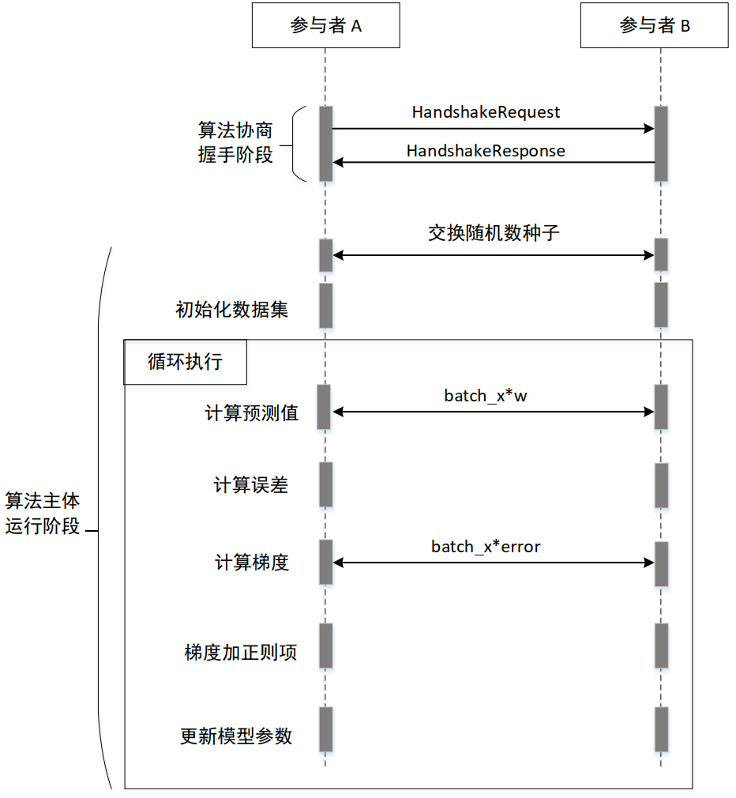
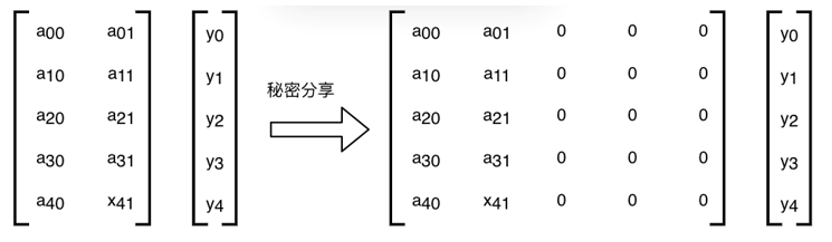

SS-LR 协议
=========================

算法流程
------------------------

算法分为2阶段，第一阶段为握手过程，第二阶段为算法主体，其流程如下：

握手过程
^^^^^^^^^^^^^^^^^^^

握手协议
""""""""""""""""""""""""""""""

握手所用的 HandshakeRequest 定义如下：

.. literalinclude:: ../../interconnection/handshake/entry.proto
   :caption: interconnection/handshake/entry.proto
   :language: Protobuf
   :start-after: [Sphinx doc begin anchor: HandshakeRequest]
   :end-before: [Sphinx doc end anchor: HandshakeRequest]
   :linenos:

HandshakeRequest 主要包括以下信息：

1. 协议版本号
2. 请求方的传输层 rank 值
3. 想使用的具体算法，比如使用 SS-LR
4. 每类算法的详细参数，比如 SS-LR 需要说明优化器类型、正则项等参数
5. 用到的安全算子的类型，比如 Sigmoid
6. 每个安全算子的详细参数，比如 Sigmoid 需要说明采用的拟合算法
7. 用到的密码协议族，比如 SS 协议族
8. 每个协议族的详细参数，比如 SS 协议族需要说明协议种类、整数环比特数等参数
9. 算法的输入和结果输出格式，比如 SS-LR 需要说明样本数量、特征数量等参数

HandshakeRequest 中的 supported_algos 字段的定义如下：

.. literalinclude:: ../../interconnection/handshake/entry.proto
   :caption: interconnection/handshake/entry.proto
   :language: Protobuf
   :start-after: [Sphinx doc begin anchor: AlgoType]
   :end-before: [Sphinx doc end anchor: AlgoType]
   :linenos:

如果算法是 SS-LR，则 HandshakeRequest 中的 algo_params 字段格式如下：

.. literalinclude:: ../../interconnection/handshake/algos/lr.proto
   :caption: interconnection/handshake/algos/lr.proto
   :language: Protobuf
   :start-after: [Sphinx doc begin anchor: LrHyperparamsProposal]
   :end-before: [Sphinx doc end anchor: LrHyperparamsProposal]
   :linenos:

LrHyperparamsProposal 中的 optimizers 字段的定义如下：

.. literalinclude:: ../../interconnection/handshake/algos/optimizer.proto
   :caption: interconnection/handshake/algos/optimizer.proto
   :language: Protobuf
   :start-after: [Sphinx doc begin anchor: Optimizer]
   :end-before: [Sphinx doc end anchor: Optimizer]
   :linenos:

LrHyperparamsProposal 中的 last_batch_policies 字段的定义如下:

.. literalinclude:: ../../interconnection/handshake/algos/lr.proto
   :caption: interconnection/handshake/algos/lr.proto
   :language: Protobuf
   :start-after: [Sphinx doc begin anchor: LastBatchPolicy]
   :end-before: [Sphinx doc end anchor: LastBatchPolicy]
   :linenos:

HandshakeRequest 中的 ops 字段的定义如下：

.. literalinclude:: ../../interconnection/handshake/entry.proto
   :caption: interconnection/handshake/entry.proto
   :language: Protobuf
   :start-after: [Sphinx doc begin anchor: OpType]
   :end-before: [Sphinx doc end anchor: OpType]
   :linenos:

如果安全算子类型是 Sigmoid，则 HandshakeRequest 中的 op_params 字段格式如下：

.. literalinclude:: ../../interconnection/handshake/op/sigmoid.proto
   :caption: interconnection/handshake/op/sigmoid.proto
   :language: Protobuf
   :start-after: [Sphinx doc begin anchor: SigmoidParamsProposal]
   :end-before: [Sphinx doc end anchor: SigmoidParamsProposal]
   :linenos:

SigmoidParamsProposal 中的 sigmoid_modes 字段的定义如下：

.. literalinclude:: ../../interconnection/handshake/op/sigmoid.proto
   :caption: interconnection/handshake/op/sigmoid.proto
   :language: Protobuf
   :start-after: [Sphinx doc begin anchor: SigmoidMode]
   :end-before: [Sphinx doc end anchor: SigmoidMode]
   :linenos:

HandshakeRequest 中的 protocol_families 字段的定义如下：

.. literalinclude:: ../../interconnection/handshake/entry.proto
   :caption: interconnection/handshake/entry.proto
   :language: Protobuf
   :start-after: [Sphinx doc begin anchor: ProtocolFamily]
   :end-before: [Sphinx doc end anchor: ProtocolFamily]
   :linenos:

如果协议族是 SS，则 HandshakeRequest 中的 protocol_family_params 字段格式如下：

.. literalinclude:: ../../interconnection/handshake/protocol_family/ss.proto
   :caption: interconnection/handshake/protocol_family/ss.proto
   :language: Protobuf
   :start-after: [Sphinx doc begin anchor: SSProtocolProposal]
   :end-before: [Sphinx doc end anchor: SSProtocolProposal]
   :linenos:

SSProtocolProposal 中的 supported_protocols 字段的定义如下：

.. literalinclude:: ../../interconnection/handshake/protocol_family/ss.proto
   :caption: interconnection/handshake/protocol_family/ss.proto
   :language: Protobuf
   :start-after: [Sphinx doc begin anchor: ProtocolKind]
   :end-before: [Sphinx doc end anchor: ProtocolKind]
   :linenos:

SSProtocolProposal 中的 field_types 字段的定义如下：

.. literalinclude:: ../../interconnection/handshake/protocol_family/ss.proto
   :caption: interconnection/handshake/protocol_family/ss.proto
   :language: Protobuf
   :start-after: [Sphinx doc begin anchor: FieldType]
   :end-before: [Sphinx doc end anchor: FieldType]
   :linenos:

SSProtocolProposal 中的 trunc_modes 字段的定义如下：

.. literalinclude:: ../../interconnection/handshake/protocol_family/ss.proto
   :caption: interconnection/handshake/protocol_family/ss.proto
   :language: Protobuf
   :start-after: [Sphinx doc begin anchor: TruncationModeProposal]
   :end-before: [Sphinx doc end anchor: TruncationModeProposal]
   :linenos:

TruncationModeProposal 中的 method 字段的定义如下：

.. literalinclude:: ../../interconnection/handshake/protocol_family/ss.proto
   :caption: interconnection/handshake/protocol_family/ss.proto
   :language: Protobuf
   :start-after: [Sphinx doc begin anchor: TruncMode]
   :end-before: [Sphinx doc end anchor: TruncMode]
   :linenos:

SSProtocolProposal 中的 prg_configs 字段的定义如下：

.. literalinclude:: ../../interconnection/handshake/protocol_family/ss.proto
   :caption: interconnection/handshake/protocol_family/ss.proto
   :language: Protobuf
   :start-after: [Sphinx doc begin anchor: PrgConfigProposal]
   :end-before: [Sphinx doc end anchor: PrgConfigProposal]
   :linenos:

PrgConfigProposal 中的 crypto_type 字段的定义如下：

.. literalinclude:: ../../interconnection/handshake/protocol_family/ss.proto
   :caption: interconnection/handshake/protocol_family/ss.proto
   :language: Protobuf
   :start-after: [Sphinx doc begin anchor: CryptoType]
   :end-before: [Sphinx doc end anchor: CryptoType]
   :linenos:

SSProtocolProposal 中的 shard_serialize_formats 字段的定义如下：

.. literalinclude:: ../../interconnection/handshake/protocol_family/ss.proto
   :caption: interconnection/handshake/protocol_family/ss.proto
   :language: Protobuf
   :start-after: [Sphinx doc begin anchor: ShardSerializeFormat]
   :end-before: [Sphinx doc end anchor: ShardSerializeFormat]
   :linenos:

SSProtocolProposal 中的 triple_configs 字段的定义如下：

.. literalinclude:: ../../interconnection/handshake/protocol_family/ss.proto
   :caption: interconnection/handshake/protocol_family/ss.proto
   :language: Protobuf
   :start-after: [Sphinx doc begin anchor: TripleConfigProposal]
   :end-before: [Sphinx doc end anchor: TripleConfigProposal]
   :linenos:

如果算法是 SS-LR，则 HandshakeRequest 中的 io_param 字段格式如下：

.. literalinclude:: ../../interconnection/handshake/algos/lr.proto
   :caption: interconnection/handshake/algos/lr.proto
   :language: Protobuf
   :start-after: [Sphinx doc begin anchor: LrDataIoProposal]
   :end-before: [Sphinx doc end anchor: LrDataIoProposal]
   :linenos:

握手请求的结果 HandshakeResponse 定义如下：

.. literalinclude:: ../../interconnection/handshake/entry.proto
   :caption: interconnection/handshake/entry.proto
   :language: Protobuf
   :start-after: [Sphinx doc begin anchor: HandshakeResponse]
   :end-before: [Sphinx doc end anchor: HandshakeResponse]
   :linenos:

其中 ResponseHeader 定义如下：

.. literalinclude:: ../../interconnection/common/header.proto
   :caption: interconnection/common/header.proto
   :language: Protobuf
   :start-after: [Sphinx doc begin anchor: ResponseHeader]
   :end-before: [Sphinx doc end anchor: ResponseHeader]
   :linenos:

如果算法是 SS-LR，则 HandshakeResponse 中的 algo_param 字段格式如下：

.. literalinclude:: ../../interconnection/handshake/algos/lr.proto
   :caption: interconnection/handshake/algos/lr.proto
   :language: Protobuf
   :start-after: [Sphinx doc begin anchor: LrHyperparamsResult]
   :end-before: [Sphinx doc end anchor: LrHyperparamsResult]
   :linenos:

如果 LR 优化器类型是 SGD，则 HandshakeResponse 中的 optimizer_param 字段格式如下：

.. literalinclude:: ../../interconnection/handshake/algos/optimizer.proto
   :caption: interconnection/handshake/algos/optimizer.proto
   :language: Protobuf
   :start-after: [Sphinx doc begin anchor: SgdOptimizer]
   :end-before: [Sphinx doc end anchor: SgdOptimizer]
   :linenos:

如果安全算子类型是 Sigmoid，则 HandshakeResponse 中的 op_params 字段格式如下：

.. literalinclude:: ../../interconnection/handshake/op/sigmoid.proto
   :caption: interconnection/handshake/op/sigmoid.proto
   :language: Protobuf
   :start-after: [Sphinx doc begin anchor: SigmoidParamsResult]
   :end-before: [Sphinx doc end anchor: SigmoidParamsResult]
   :linenos:

如果协议族是 SS，则 HandshakeResponse 中的 protocol_family_params 字段格式如下：

.. literalinclude:: ../../interconnection/handshake/protocol_family/ss.proto
   :caption: interconnection/handshake/protocol_family/ss.proto
   :language: Protobuf
   :start-after: [Sphinx doc begin anchor: SSProtocolResult]
   :end-before: [Sphinx doc end anchor: SSProtocolResult]
   :linenos:

SSProtocolResult 中的 trunc_mode 字段的定义如下：

.. literalinclude:: ../../interconnection/handshake/protocol_family/ss.proto
   :caption: interconnection/handshake/protocol_family/ss.proto
   :language: Protobuf
   :start-after: [Sphinx doc begin anchor: TruncationModeResult]
   :end-before: [Sphinx doc end anchor: TruncationModeResult]
   :linenos:

SSProtocolResult 中的 prg_config 字段的定义如下：

.. literalinclude:: ../../interconnection/handshake/protocol_family/ss.proto
   :caption: interconnection/handshake/protocol_family/ss.proto
   :language: Protobuf
   :start-after: [Sphinx doc begin anchor: PrgConfigResult]
   :end-before: [Sphinx doc end anchor: PrgConfigResult]
   :linenos:

SSProtocolResult 中的 triple_config 字段的定义如下：

.. literalinclude:: ../../interconnection/handshake/protocol_family/ss.proto
   :caption: interconnection/handshake/protocol_family/ss.proto
   :language: Protobuf
   :start-after: [Sphinx doc begin anchor: TripleConfigResult]
   :end-before: [Sphinx doc end anchor: TripleConfigResult]
   :linenos:

如果算法是 SS-LR，则 HandshakeResponse 中的 io_param 字段格式如下：

.. literalinclude:: ../../interconnection/handshake/algos/lr.proto
   :caption: interconnection/handshake/algos/lr.proto
   :language: Protobuf
   :start-after: [Sphinx doc begin anchor: LrHyperparamsResult]
   :end-before: [Sphinx doc end anchor: LrHyperparamsResult]
   :linenos:

Protobuf 传输方式
""""""""""""""""""""""""""""""

Protobuf 传输使用《传输层白盒互联互通协议》中的 P2P 传输协议进行传输。其中传输的 key 按照《传输层白盒互联互通协议》中定义的方法生成，
value 即为 protobuf 序列化之后的二进制字符串。

算法主体
^^^^^^^^^^^^^^^^^^^

在协议主体运行阶段，SS-LR 基于 mini-batch 梯度下降训练方法，对于每一个 batch，协议的执行过程中，底层都是用 SPDZ Semi2k 秘密分享协议，
以确保计算过程中每一个变量都处在 Arithmetic Sharing 状态，每一方仅能看到本地分片值，看不到明文值，保证了算法执行过程中没有泄露原始信息。

LR 算法训练过程
""""""""""""""""""""""""""""""

LR 算法公式为：

.. math:: y = sigmoid(x_0w_0 + x_1w_1 + ⋯ + x_kw_k + intercept)

.. math::y = sigmoid(x_0w_0 + x_1 w_1 + ⋯ + x_kw_k + intercept)

其中 :math:`x` 表示特征项，:math:`w` 是 LR 模型的权重，:math:`intercept` 是截距项， :math:`w` 和 :math:`intercept` 都是可训练的参数，
:math:`sigmoid` 是一个 S 型函数，公式如下：

.. math:: sigmoid(x)=1/(1+e^{-x})

在隐私计算场景下，Sigmoid 函数直接计算有困难，本文件使用近似函数计算的方案，详见 :ref:`Sigmoid算子 <sigmoid>`

此外，为了统一 :math:`w` 和 :math:`intercept` 的形式，简化计算流程，我们将 :math:`intercept` 也看作是 :math:`w` 向量的一个元素，
即假设特征数为 :math:`k` 个，则 :math:`w` 向量的长度为 :math:`k+1`，之后在计算时，我们在 :math:`x` 的最后拼接一个 :math:`1`，
即可直接计算向量内积 :math:`w*x`，
简化计算步骤。

在实际训练时，LR 模型训练采用 mini-batch 梯度下降方法，重复执行如下五个步骤，直到达到目标迭代次数：

第一步：计算预测值 :math:`pred=sigmoid(batch\_x*w)`

第二步：计算误差 :math:`err=pred-y`

第三步：计算梯度 :math:`grad=transpose(batch\_x)*err`

第四步：梯度加正则项 :math:`grad=grad + w^{'}*l2\_norm`

第五步：更新模型参数 :math:`w=w-(grad*learning\_rate/batch\_size)`

其中：

- :math:`batch\_x` 是当前 batch 的样本数据集与常数项组成的矩阵，其中常数项为 :math:`1`，位于 :math:`batch\_x` 的最后一列；
- :math:`w` 是 LR 模型训练的结果，初始值为 :math:`0`；
- :math:`sigmoid()` 是常被用作神经网络的激活函数，将变量映射到 :math:`0`, :math:`1` 之间；
- :math:`*` 是乘法；
- :math:`y` 是当前 batch 的标签矩阵；
- :math:`transpose()` 是矩阵转置操作；
- :math:`w^{'}` 是将 :math:`w` 的截距项即最后一个元素置为 :math:`0`；
- :math:`l2\_norm` 是 l2 正则项；
- :math:`learning\_rate` 是学习率参数；
- :math:`batch\_size` 是每个 batch 的大小。

基于 Semi2K 的纵向 SS-LR 算法
""""""""""""""""""""""""""""""

这里描述基于 Semi2K 协议的两方秘密分享纵向 LR 算法的计算过程。

数据集初始化
*****************

各参与方首先对输入的样本数据 :math:`batch\_x` 和标签矩阵 :math:`y` 进行编码和秘密分片。

**输入数据编码**

输入数据集的元素类型为浮点数类型，将其按统一的放大系数转为定点数，然后去掉小数部分转为整数，在整数环上计算。编码方式如下表所示，
整数环可取长度 64、128 等，元素编码后的数据类型分别为 int64_t、int128_t。放大系数和整数环的比特数在握手协议中约定。

.. list-table:: 输入数据集元素编码
   :widths: 25 25 25
   :header-rows: 1

   * - 实际数据类型
     - 整数环的比特数
     - 编码数据类型（ISO C99）
   * - 浮点数
     - 64
     - int64_t
   * - 浮点数
     - 128
     - int128_t

**输入数据秘密分享**

双方根据握手协议确定的样本数量、特征数量和标签信息，以及各自的输入样本数据集，首先通过秘密分享的方式计算出初始密态样本数据集。
对于每个样本元素 :math:`x`，秘密分享获得两个密态分片 :math:`x` 和 :math:`0` ( :math:`x=x+0` )，将 :math:`x` 留在本地，将 :math:`0` 发给对方
（由于 :math:`0` 不是随机数，所以省略这个发送过程）。

若样本总数量等于5，样本特征数量等于数组 [2, 3]，参与方 A（rank=0）拥有2个维度的特征和5个样本的标签，参与方 B（rank=1）拥有3个维度的特征。

双方对样本数据集进行秘密分享。参与方 A 初始化秘密分享的结果如下图：

参与方 B 初始化秘密分享的结果如下图：

.. image:: _img/dataset-ss-b.png
   :scale: 60%
   :align: center

**交换伪随机数种子**

双方各有一个属于自己的伪随机数种子，用于将公共明文转为密文，详见 :ref:`公共明文转为密文 <p2a>`。初始阶段双方向对方发送这个伪随机数种子。

**向Beaver服务发送伪随机数种子**

除了上一节的伪随机数种子，双方还各自持有另一个伪随机数种子，用于从第三方可信 Beaver 服务获取乘法三元组，详见 :ref:`beaver`。初始阶段双方分别向 Beaver 服务发送自己的这个伪随机数种子。

.. _drbg:

伪随机数生成方式
*****************

密码学安全的伪随机数生成器应当按照美国 NIST SP800-90A 标准或者中华人民共和国密码行业标准《GM/T 0105-2021软件随机数发生器设计指南》中规定的方式实现。伪随机数的安全强度要达到128比特。

安全算子
*****************

.. _sigmoid:

**Sigmoid算子**

在 Semi2K 协议下无法直接计算 Sigmoid 函数，本文件使用近似计算方案。Sigmoid有多种拟合算法，其中一种较为简单，并且不需要交互的近似计算方法如下：

Minimax逼近方法，其公式为：:math:`f(X)=0.5+0.125*X`。

**Semi2k算子**

.. _p2a:

1. 公共明文转为密文

将 :math:`batch\_x` 常数项 :math:`1` 转为密文，将 :math:`w^{'}` 的截距项 :math:`0` 转为密文，这两处涉及公共明文转为密文。

假设公共明文等于 :math:`p`，参与方 A 使用自己的伪随机数种子生成随机数 :math:`r_0`，B 使用自己的伪随机数种子生成随机数 :math:`r_1`，
生成方式参照 :ref:`drbg`。由于双方都知道对方的伪随机数种子，且双方维护的计数器始终保持一致，所以可以计算出对方生成的伪随机数。
最终，A 的密态分片等于 :math:`p+r_0-r_1`，B 的密态分片等于 :math:`r_1-r_0`。

2. 明文常量 × 密文向量

Sigmoid 的 Minimax 逼近公式和梯度加正则项公式中涉及明文常量与密文向量相乘，即 :math:`0.125*X`，:math:`w^{'}*l2\_norm`。
此算子不涉及参与方之间的通信，双方各自在本地将明文常量与密文分片直接相乘即可。

3. 明文常量 + 密文向量

Sigmoid 的 Minimax 逼近公式中涉及明文常量与密文向量相加，即 :math:`0.5+0.125*X`。

对于两个参与方（参与方 A 为 rank 0，参与方 B 为 rank 1）的情况，将明文常量直接加在 A 方的密文分片上，B 方的密文分片不变。

4. 密文向量 + 密文向量

梯度更新公式 :math:`grad=grad+w^{'}*l2\_norm` 涉及密文向量与密文向量相加。

此算子不涉及参与方之间的通信，双方在本地将两个密文的分片直接相加即可。

5. 密文向量 - 密文向量

误差计算公式 :math:`err=pred-y` 涉及密文向量与密文向量相减。此算子不涉及参与方之间的通信，双方在本地将两个密文的分片直接相减即可。

6. 密文矩阵 * 密文矩阵

公式 :math:`batch\_x*w` 和公式 :math:`grad=transpose(batch\_x)*err` 涉及密文矩阵与密文矩阵相乘。算子的实现定义如下：

:math:`X_i`、:math:`Y_i` (:math:`i=0` 或 :math:`1`) 分别是 :math:`X`、:math:`Y` 的密文分片，以下步骤是计算 :math:`Z_i=[X*Y]_i` 的实现。

- 可信第三方生成 Beaver 矩阵乘法三元组(:math:`A_i`，:math:`B_i`，:math:`C_i`)，生成方式参见 :ref:`beaver`。

- 双方同时解密得到 :math:`X-A` 和 :math:`Y-B`：

  双方分别本地计算 :math:`X_i-A_i` 和 :math:`Y_i-B_i` ，然后调用传输层协议接口先后获得对方的分片 :math:`X_{1-i}-A_{1-i}` 和 :math:`Y_{1-i}-B_{1-i}`。双方分别在本地执行加法后得到 :math:`X-A` 和 :math:`Y-B`。

- 各方分别在本地执行以下计算：

  :math:`Z_i=C_i+(X-A)*B_i+A_i*(Y-B)+(1-i)×(X-A)*(Y-B)`

- 对 :math:`Z_i` 进行截断，截断的实现方式参照 :ref:`密文截断 <truncation>`

.. _truncation:

7. 密文截断

乘法计算后要对结果进行截断（Truncation）。有多种对秘密分享分片截断的方案，其中一种不需要交互但有一定出错概率的截断算法方案如下：

一方直接对其分片向右移动指定截断位数，另一方用 :math:`2^n` 减分片，将减法结果向右移动指定截断位数，再用 :math:`2^n` 减右移后的分片。

此处的移动指逻辑右移，即对于 int64/int128 变量，如果数值为自然数，右移时高位补 :math:`0`，如果数值为负数，右移时高位补 :math:`1`。

.. _beaver:

Beaver 矩阵乘法三元组
""""""""""""""""""""""""""""""

在矩阵乘法计算过程中，参与方 A 和 B 获得矩阵乘法三元组分片（:math:`A_0`，:math:`B_0`，:math:`C_0`）和（:math:`A_1`，:math:`B_1`，:math:`C_1`），满足 :math:`(A_0+A_1)*(B_0+B_1)=(C_0+C_1)`。三元组分片是各方通过私有的随机数种子生成的，所以对另一方不可见。

Beaver 三元组生成方式
*****************

乘法三元组有多种实现算法方案，包括两方实现的算法方案和第三方辅助的算法方案。以下是一种第三方辅助的算法方案的实现设计。

以可信第三方的 Beaver 服务为例。Beaver 服务器知道参与方 A 和参与方 B 的随机数种子，通过相同的伪随机数生成算法和参数生成与 A 和 B 相同的伪随机数，即三元组分片分片（:math:`A_0`，:math:`B_0`，:math:`C_0`）和（:math:`A_1`，:math:`B_1`，:math:`C_1`）。Beaver服务计算 :math:`adjust=(A_0+A_1)*(B_0+B_1)-(C_0+C_1)`，得到调整值 :math:`adjust`。参与方 A（或参与方 B）从Beaver 服务获取 :math:`adjust` 值，并将其加到 :math:`C_0` （或 :math:`C_1`）分片上得到新的 :math:`C_0` （或 :math:`C_1`），最终得到的就是符合条件的矩阵乘法三元组。

