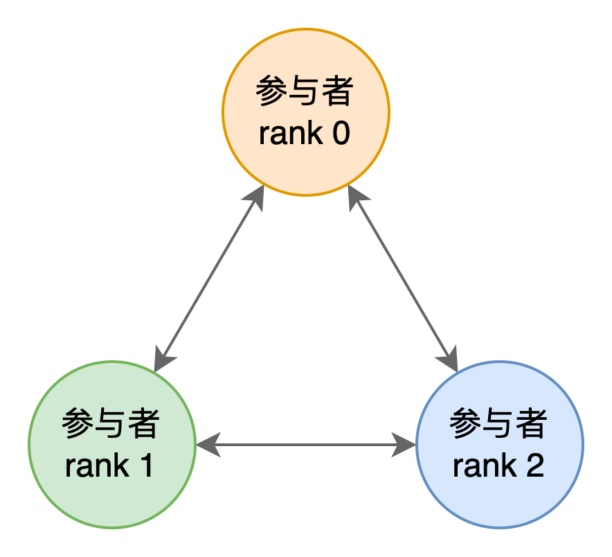
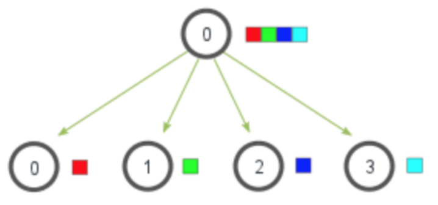
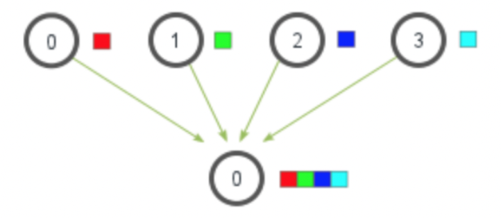
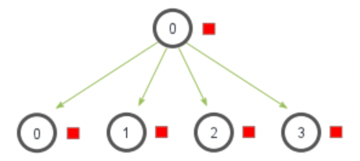
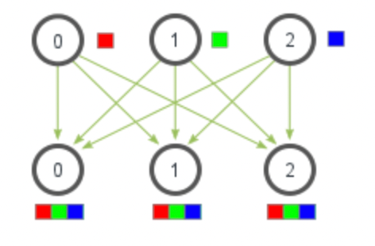
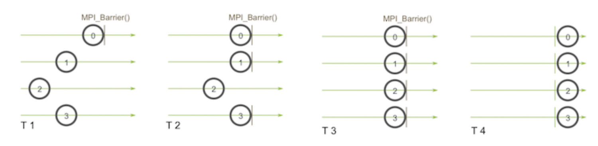

传输层协议（一期）
============================

背景
---------

传输层定义了一组标准化接口，用于在不同隐私计算的参与者之间传递信息。

传输层协议
-------------------

接口定义
^^^^^^^^^^^^^^^^^^

两个参与者之间通过 gRPC 协议传输消息，消息传输的 protobuf 格式定义如下：

.. literalinclude:: ../../interconnection/link/transport.proto
   :caption: interconnection/link/transport.proto
   :language: Protobuf
   :start-after: [Sphinx doc begin anchor: ReceiverService]
   :end-before: [Sphinx doc end anchor: ReceiverService]
   :linenos:

其中关于 ResponseHeader 定义如下：

.. literalinclude:: ../../interconnection/common/header.proto
   :caption: interconnection/common/header.proto
   :language: Protobuf
   :start-after: [Sphinx doc begin anchor: ResponseHeader]
   :end-before: [Sphinx doc end anchor: ResponseHeader]
   :linenos:

接口说明：

1. 传输层所有消息收发都通过唯一接口 ``rpc Push(PushRequest) returns (PushResponse)`` 完成。
2. 一个通信组的每一个成员拥有一个唯一编号（rank），编号为自然数，从0开始，成员的编号必须连续，成员具体编号在初始化阶段由外部指定。举例：一个三方隐私计算任务中成员编号分别为 0、1、2。
3. 消息传送支持全量传送（TransType::MONO）和分块传送（TransType::CHUNKED）两种模式，使用哪种传输模式由发送者决定，分块传输模式下每一个切块的大小亦由发送方决定。
4. 每一个消息拥有一个全局唯一的 key，key 的生成方式见下文。对于分块传输模式，同一个消息体（Message）切块后每一块的 key 相同。

握手协议
^^^^^^^^^^^^^^^^^^

握手协议用于初始化通信组，整个协议在全生命周期只执行一次。 握手协议 message key 命名规则： ``connect_{self_rank_id}``，举例：``connect_0``，``connect_1``，``connect_2``

**握手协议流程**

每一个参与者执行以下流程：

.. code-block:: text
   :linenos:

   For i in 0..word_size:
     if i == self_rank:
       continue
     Async send to rank i: {key: connect_{self_rank}, value: ""}

   For i in 0..word_size:
     if i == self_rank:
       continue
     Recv on key connect_{i}

握手协议分为两部分：第一部分向其它参与者广播自己的存在性，即向他人发送 ``connect_{self_rank}`` 消息；第二部分检查他人的存在性，即依次检查 ``connect_{rank}`` 消息已经收到。

信道
""""""""""""""""""""

信道是一个逻辑概念，用于区分通信的上下文。每一个信道有一个全局唯一名称，命名规则为：``\w+``，即信号名称由字母、数字、下划线组成。信道的名字由通信组双方约定，在初始化阶段由用户传入。

信道唯一的作用就是影响 message key 的生成，信道名称会作为 message key 一部分，因此，不同信道中的消息一定不会有相同的 key，因此不同信道的消息在逻辑上不会混淆。

子信道
~~~~~~~~~~~~

当上层算法需要多个信道时，我们统一把第一个信道称为主信道，其它信道称为子信道。子信道的命名规则为：``主信道名称-子信道编号``，举例：假设主信道名称为 root，则 0 号子信道名称为 ``root-0``，1 号子信道名称为 ``root-1``，以此类推。

P2P 通信
^^^^^^^^^^^^^^^^^^

P2P 通信允许在任意两个参与者之间发送信息。P2P 通信 key 的命名规则为：``{信道名称}:P2P-{计数器}:{发送者 RANK}->{接收者 RANK}``，其中每一个信道、每一对 ``<sender，receiver>`` 都有一个独立的计数器。

举例，假设信道名称为 root，以下消息依次发送：

.. code-block:: text
   :linenos:

   Rank 0 → 1 发送消息，key 为：root:P2P-1:0->1
   Rank 1 → 0 发送消息，key 为：root:P2P-1:1->0
   Rank 0 → 2 发送消息，key 为：root:P2P-1:0->2
   Rank 0 → 1 发送消息，key 为：root:P2P-2:0->1

Scatter
^^^^^^^^^^^^^^^^^^

Scatter 用于把某一方的数据切分后发送给所有其它方，如下图所示：

Scatter 操作所有参与方使用相同的 key 通信，key 命名规则为：``{信道名称}:{信道全局计数器}:SCATTER``，此处的计数器每一个信道有且只有一个，在信道内是全局的，是除 P2P 通信之外所有通信算法共享的。也就是说每一个信道会维护两类计数器，一类是 P2P 通信用的计数器，另一类就是这个全局计数器。

举例，假设 rank 0 要 scatter 数据，则协议流程如下：

.. code-block:: text
   :linenos:

   时间点1：RANK 0 Scatter
   RANK 0 构建 PushRequest 发送给 RANK 1，其中 key 为 root:1:SCATTER
   RANK 0 构建 PushRequest 发送给 RANK 2，其中 key 为 root:1:SCATTER
   RANK 0 构建 PushRequest 发送给 RANK 3，其中 key 为 root:1:SCATTER
   RANK 1 接收 key 为 root:1:SCATTER 的数据
   RANK 2 接收 key 为 root:1:SCATTER 的数据
   RANK 3 接收 key 为 root:1:SCATTER 的数据

   时间点2：RANK 1 Scatter
   RANK 1 构建 PushRequest 发送给 RANK 0，其中 key 为 root:2:SCATTER
   RANK 1 构建 PushRequest 发送给 RANK 2，其中 key 为 root:2:SCATTER
   RANK 1 构建 PushRequest 发送给 RANK 3，其中 key 为 root:2:SCATTER
   RANK 0 接收 key 为 root:2:SCATTER 的数据
   RANK 2 接收 key 为 root:2:SCATTER 的数据
   RANK 3 接收 key 为 root:2:SCATTER 的数据

Gather
^^^^^^^^^^^^^^^^^^

Gather 的作用正好与 Scatter 相反，用于将数据汇集到一方，如下图：

Gather 通信 Key 的命名规则为：``{信道名称}:{信道全局计数器}:GATHER``，此处的信道全局计数器与 Scatter 中的计数器是同一个。

.. code-block:: text
   :linenos:

   时间点3：RANK 0 Gather
   RANK 1 构建 PushRequest 发送给 RANK 0，其中 key 为 root:3:GATHER
   RANK 2 构建 PushRequest 发送给 RANK 0，其中 key 为 root:3:GATHER
   RANK 3 构建 PushRequest 发送给 RANK 0，其中 key 为 root:3:GATHER
   RANK 0 接收 来自 RANK 1 的 key 为 root:3:GATHER 的数据
   RANK 0 接收 来自 RANK 2 的 key 为 root:3:GATHER 的数据
   RANK 0 接收 来自 RANK 3 的 key 为 root:3:GATHER 的数据

其它算法
^^^^^^^^^^^^^^^^^^

以上为传输层互联互通一期标准协议，以下接口协议将在二期标准中定义。

广播：Bcast

全局收集：Allgather

路障同步：Barrier

